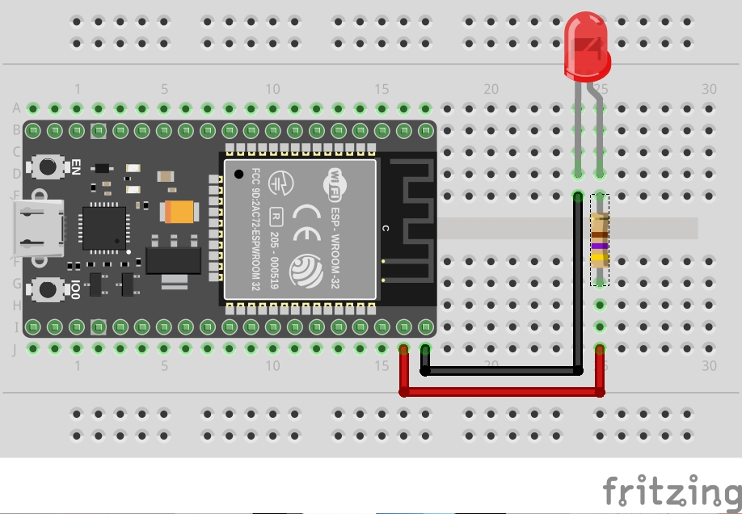
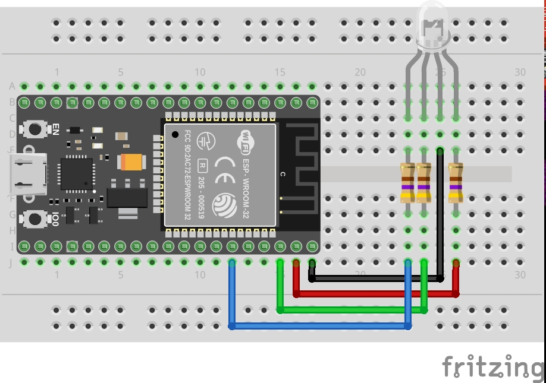

# Blinking LED with Micropython and ESP32

As prerequisites you might need to follow the instructions
on how to setup Pipenv and how to setup Micropython on ESP32.
Please take a look at
[https://github.com/danielwohlgemuth/setup-micropython-esp32](https://github.com/danielwohlgemuth/setup-micropython-esp32).

## Install

Install the dependencies listed in the Pipfile.

```bash
pipenv install
```

```bash
pipenv run ampy --help
pipenv run rshell --help
```

## Pinout

The pinout of my ESP32 looks like this.


Image from [http://forum.fritzing.org/t/esp32s-hiletgo-dev-boad-with-pinout-template/5357](http://forum.fritzing.org/t/esp32s-hiletgo-dev-boad-with-pinout-template/5357)

You can find the pinout for other ESP32's by searching for **pinout**
on [http://esp32.net/](http://esp32.net/) and follow those links.

## Single LED

### Setup circuit



Connect the ground pin to the shorter leg.
Connect pin 23 to the other leg, with a 470Ω resistor in between
to prevent de LED from burning out. If you don't have a resistor with that exact value, just use something close enough.

Since I didn't have 470Ω resistors, I used two 1kΩ resistors in parallel,
to get 500Ω. The formula for that is `1/Rt = 1/R1 + 1/R2 + ...`.
In this case `1/Rt = 1/1000 + 1/1000` --> `1/Rt = 2/1000` -->
`Rt = 1000/2` --> `Rt = 500`.

You could also use two 220Ω resistors in series/sequentially to add up to 440Ω.

### Connect to interactive shell

```bash
pipenv run rshell --port /dev/ttyUSB0 repl
```

You can exit the shell by pressing <kbd>CTRL</kbd> + <kbd>X</kbd>.

If you can't reconnect afterwards, you might need to restart your ESP32
by pressing the EN button.

### Try manually

Once you are connected to the interactive shell,
try these commands to turn the led on and off.

```python
import machine

led = machine.Pin(23, machine.Pin.OUT)

led.value(1)
led.value(0)
```

If the led doesn't turn on, it might just be connected the wrong way around.
Connect the ground pin to the longer leg and pin 23 to the other leg
and try again.

### Try examples

After verifying that the circuit works correctly,
upload the examples and execute them after a restart.
The uploaded file has to be called `main.py`
and gets executed when the ESP32 starts up.

[blink.py](blink.py) blinks the led once long and twice short.

```bash
cp blink.py main.py
pipenv run ampy --port /dev/ttyUSB0 put main.py
# Restart the ESP32 to execute it by pressing the EN button
```

[fade.py](fade.py) fades the led on and off
according to a sine wave using pulse width modulation (PWM).

```bash
cp fade.py main.py
pipenv run ampy --port /dev/ttyUSB0 put main.py
```

## RGB LED

### Setup circuit



Connect the ground pin to the longer leg.
Connect pin 23, 22, and 21 with the other legs,
with a 470Ω resistors between each pin and the led.

[fade-rgb.py](fade-rgb.py) fades the rgb led using three sine waves,
with the start of each sine wave shifted from the others
to make the three color light up at different times.

```bash
cp fade-rgb.py main.py
pipenv run ampy --port /dev/ttyUSB0 put main.py
```

[fade-hsv.py](fade-hsv.py) fade the rgb led by converting
from the HSV (Hue, Saturation, Value) color space to RGB
to have three times in a cycle where only one color is lit up.

```bash
cp fade-hsv.py main.py
pipenv run ampy --port /dev/ttyUSB0 put main.py
```
